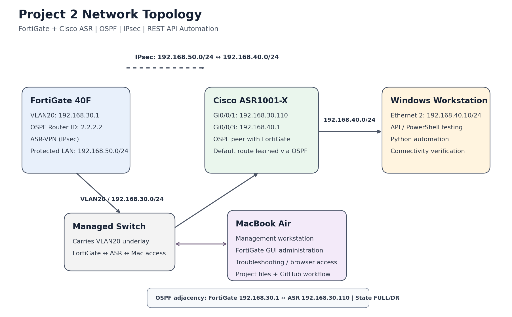
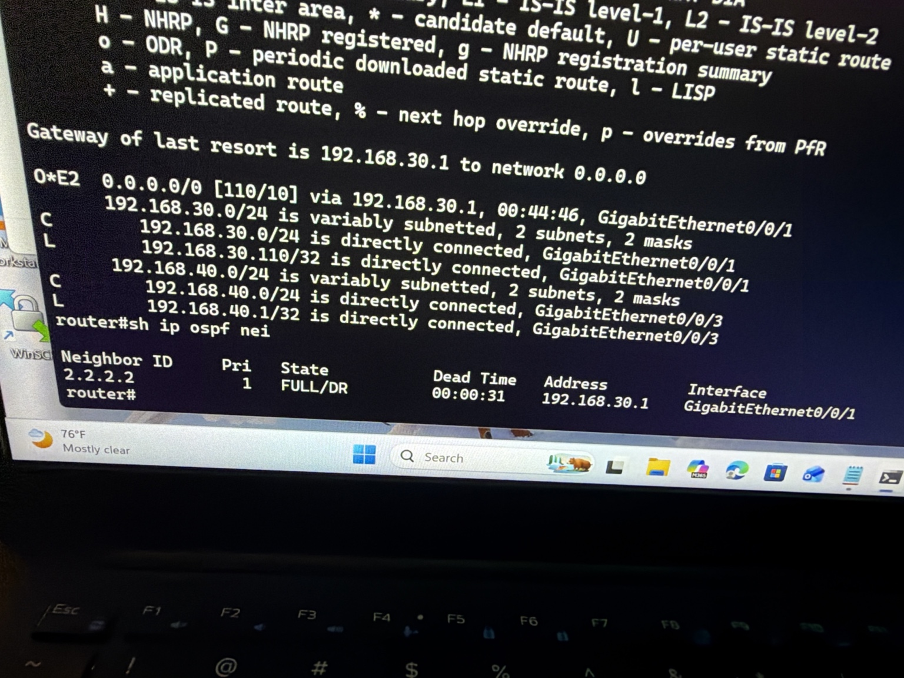
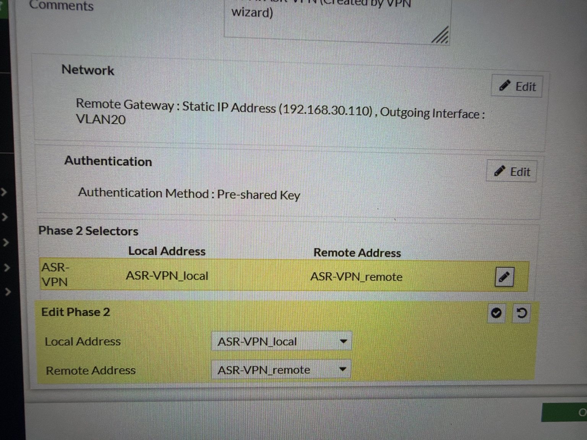
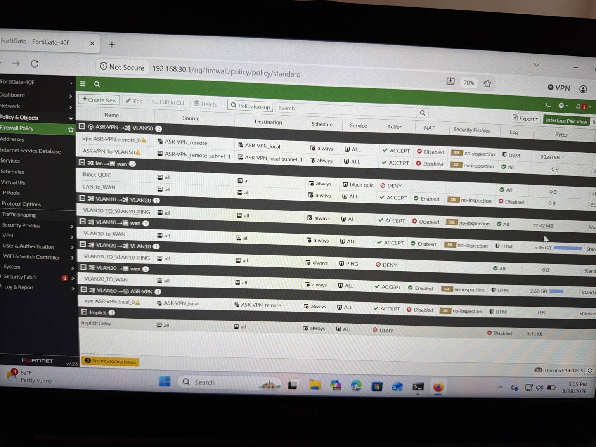
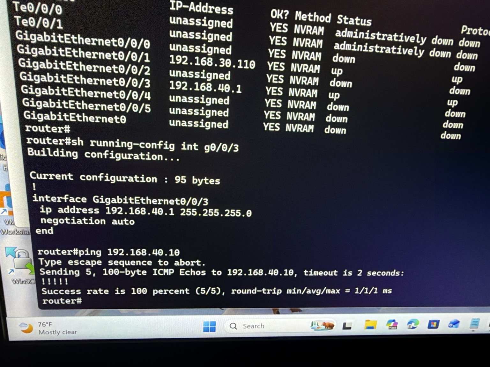
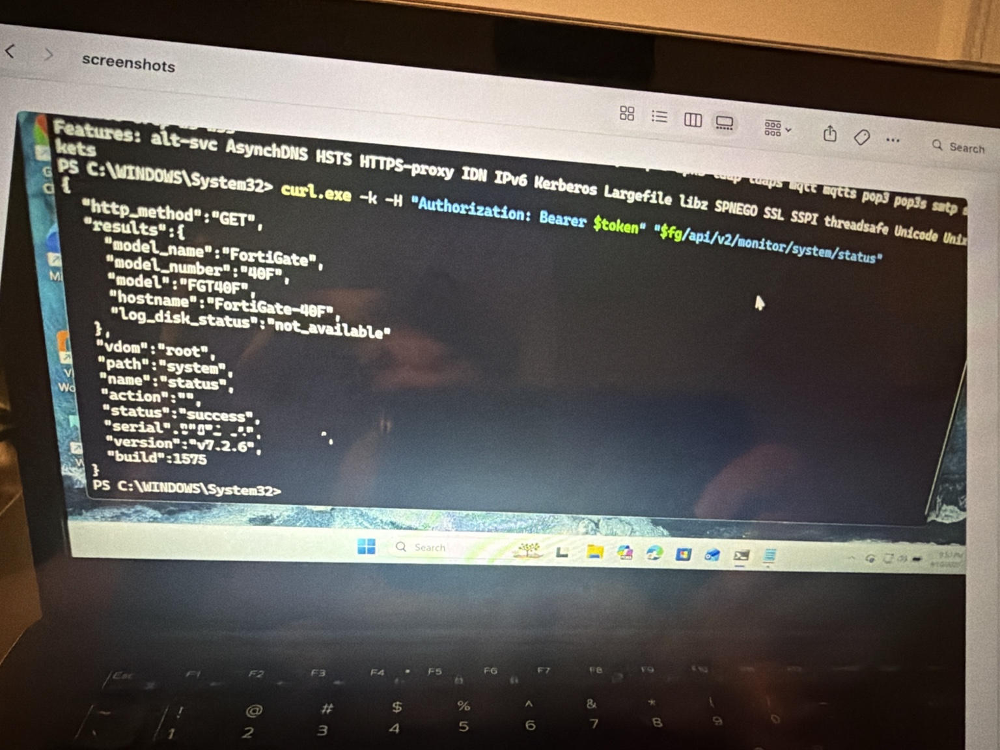

# FortiGate + Cisco ASR OSPF & API Automation Lab

## Project Overview

This project demonstrates a physical networking and security lab built with a FortiGate 40F firewall, Cisco ASR1001-X router, managed switch, Windows workstation, and MacBook Air management workstation.

The lab combines dynamic routing, firewall/VPN configuration, troubleshooting, REST API testing, and Python automation. The goal was not only to make the devices communicate, but also to verify each layer and document the results in a portfolio-ready format.

## Technologies & Equipment

- Fortinet FortiGate 40F
- Cisco ASR1001-X
- Managed Ethernet switch
- Windows workstation
- MacBook Air management workstation
- FortiOS 7.2.6
- Cisco IOS XE
- OSPF
- IPsec site-to-site VPN configuration
- REST API
- Python 3
- PowerShell
- SSH and ICMP

## Lab Objectives

- Build routed connectivity between the FortiGate, Cisco ASR, and Windows workstation.
- Use the MacBook Air as a management workstation for FortiGate GUI administration, troubleshooting, and project/GitHub workflow.
- Establish and verify an OSPF adjacency.
- Learn a default route dynamically on the ASR from the FortiGate.
- Configure and document an IPsec VPN between FortiGate and Cisco ASR.
- Verify firewall policies and protected network selectors.
- Test the FortiGate REST API from Windows.
- Automate a FortiGate system-status request with Python.
- Apply a structured troubleshooting workflow and document the evidence.

## Network Addressing

| Device / Interface | Address | Purpose |
| --- | --- | --- |
| FortiGate VLAN20 | `192.168.30.1` | FortiGate side of the routing/OSPF network |
| Cisco ASR Gi0/0/1 | `192.168.30.110` | ASR connection toward FortiGate |
| Cisco ASR Gi0/0/3 | `192.168.40.1` | Routed interface toward test workstation |
| Windows Ethernet 2 | `192.168.40.10/24` | Test and automation workstation |
| MacBook Air | VLAN20 management access | FortiGate GUI administration, troubleshooting, and project/GitHub workflow |
| VPN protected network (FortiGate side) | `192.168.50.0/24` | Local Phase 2 selector |
| VPN protected network (ASR side) | `192.168.40.0/24` | Remote Phase 2 selector |



## OSPF Dynamic Routing

OSPF was configured between the FortiGate and Cisco ASR over `192.168.30.0/24`.

Verified results:

- FortiGate router ID: `2.2.2.2`
- OSPF area: `0.0.0.0`
- ASR neighbor address: `192.168.30.1`
- ASR neighbor state: `FULL/DR`
- OSPF administrative distance: `110`
- Default route metric: `10`
- Default route advertised as External Type 2

The Cisco ASR learned:

```text
O*E2 0.0.0.0/0 via 192.168.30.1
```



## IPsec VPN Configuration

The FortiGate VPN was created as `ASR-VPN` using the Cisco site-to-site template.

Key settings confirmed from the FortiGate configuration:

- Remote peer: `192.168.30.110`
- Outgoing interface: VLAN20
- Authentication: Pre-shared key
- IKE version: IKEv1
- Phase 1 proposal: AES256-SHA256
- Diffie-Hellman group: 14
- Phase 1 lifetime: 86400 seconds
- Phase 2 proposal: AES256-SHA256
- Phase 2 lifetime: 3600 seconds
- PFS: disabled
- Local protected network: `192.168.50.0/24`
- Remote protected network: `192.168.40.0/24`

The pre-shared key is intentionally not stored in this repository.



## Firewall Policies

VPN policies were configured in both directions between `ASR-VPN` and VLAN50. NAT was disabled on the VPN policies so the original private IP addresses remain visible across the protected networks.



## Connectivity Verification

Connectivity and management access were verified across the lab. The MacBook Air was used to access and administer the FortiGate GUI, troubleshoot browser/certificate access, and manage the project documentation/GitHub workflow.

- Windows workstation to ASR Gi0/0/3 (`192.168.40.1`)
- Cisco ASR to Windows workstation (`192.168.40.10`)
- OSPF adjacency between FortiGate and ASR
- Dynamically learned OSPF default route on the ASR

The first Windows ping showed one timeout, followed by successful replies; the repeat test completed with 0% packet loss. This is consistent with initial neighbor/ARP resolution rather than a persistent routing failure.



## FortiGate REST API

The FortiGate monitor endpoint used in the lab was:

```text
/api/v2/monitor/system/status
```

PowerShell/cURL testing was used first to isolate API authentication and connectivity before automating the same request with Python.

Successful API output confirmed:

- Status: success
- Hostname: FortiGate-40F
- Model: 40F
- FortiOS version: v7.2.6
- Build: 1575



## Python Automation

The script in `automation/fortigate_api.py`:

1. Prompts for the FortiGate API token at runtime.
2. Sends an authenticated HTTPS request to the FortiGate system-status endpoint.
3. Parses the JSON response.
4. Prints selected system information.

The API token is **not hardcoded** in the source file.

For this self-signed home-lab environment, certificate verification is disabled in the example script. In production, certificate validation should remain enabled and a trusted certificate should be used.

## Troubleshooting Experience

Troubleshooting included:

- Interface and IP-address verification
- Routing-table inspection
- OSPF neighbor-state verification
- Direct ICMP testing
- API authentication troubleshooting
- HTTP `401 Unauthorized` and `429 Too Many Requests` responses
- PowerShell/cURL syntax correction
- Separating network/API problems from Python script problems

Detailed notes are in [`documentation/troubleshooting.md`](documentation/troubleshooting.md).

## Security Considerations

Do not commit any of the following to a public repository:

- FortiGate API tokens
- Passwords
- VPN pre-shared keys
- Private credentials
- Screenshots that display active secrets

The included screenshots were selected to document the lab without exposing the API token or VPN pre-shared key.

## Repository Structure

```text
fortigate-asr-ospf-api-automation-lab/
├── README.md
├── network-topology.png
├── Project_2_FortiGate_ASR_OSPF_API_Automation_Lab.docx
├── automation/
│   └── fortigate_api.py
├── documentation/
│   ├── commands.md
│   └── troubleshooting.md
└── screenshots/
    ├── 01-asr-interfaces-and-ping.jpeg
    ├── 02-ospf-neighbor-and-default-route.jpeg
    ├── 03-fortigate-ospf-default-route-settings.jpeg
    ├── 04-ipsec-phase2-selectors.jpeg
    ├── 05-vpn-firewall-policies.jpeg
    ├── 06-api-troubleshooting-401-429.jpeg
    ├── 07-api-success-system-status.jpeg
    └── 08-workstation-connectivity.jpeg
```

## Skills Demonstrated

- Cisco IOS XE routing and interface verification
- OSPF neighbor establishment and route interpretation
- FortiGate routing and default-route advertisement
- FortiGate IPsec VPN configuration
- Firewall policy review
- Layered network troubleshooting
- PowerShell/cURL API testing
- REST API authentication
- Python network automation
- Secure handling of API credentials
- Multi-workstation lab management (Windows + macOS)
- Technical documentation and GitHub portfolio organization

## Key Result

The lab successfully demonstrated routed FortiGate-to-ASR connectivity, a verified OSPF adjacency in `FULL/DR`, an OSPF-learned default route on the ASR, FortiGate API access, working Python automation, and MacBook-based FortiGate management/documentation workflow. The IPsec configuration and firewall policy design were also documented as part of the security portion of the project.

**Project Status: Completed**
